# Claims Module - Architecture Diagrams

## System Overview

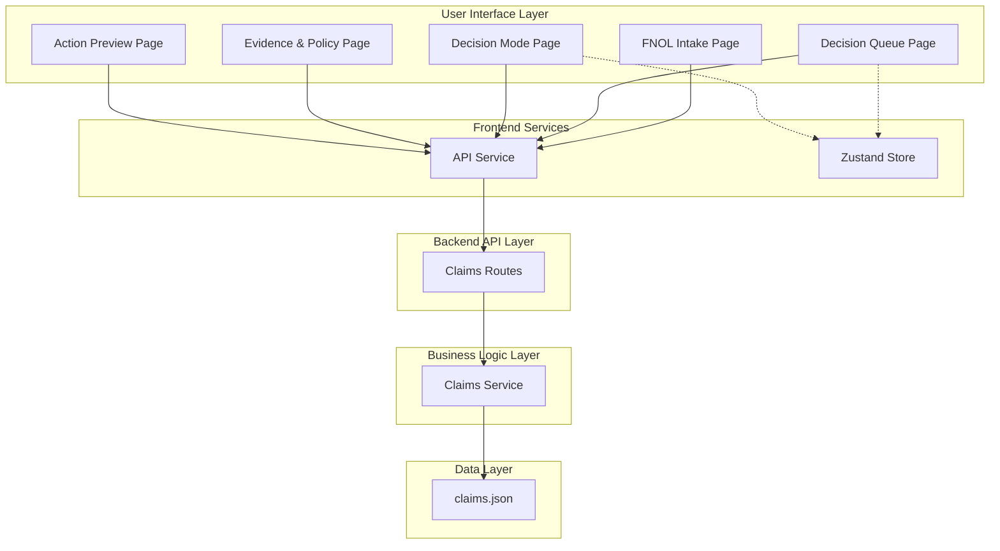

## User Journey Flow

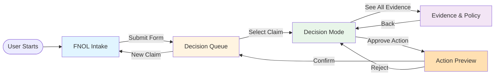

## Component Hierarchy

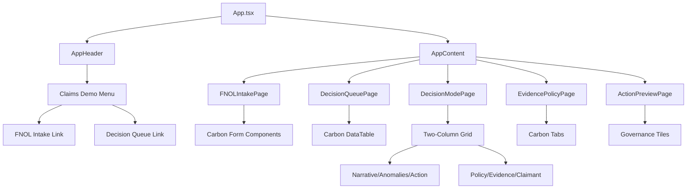

## Data Flow - FNOL Submission

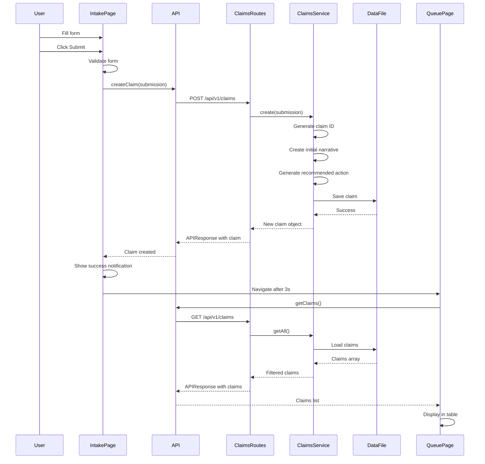

## Data Flow - Decision Approval

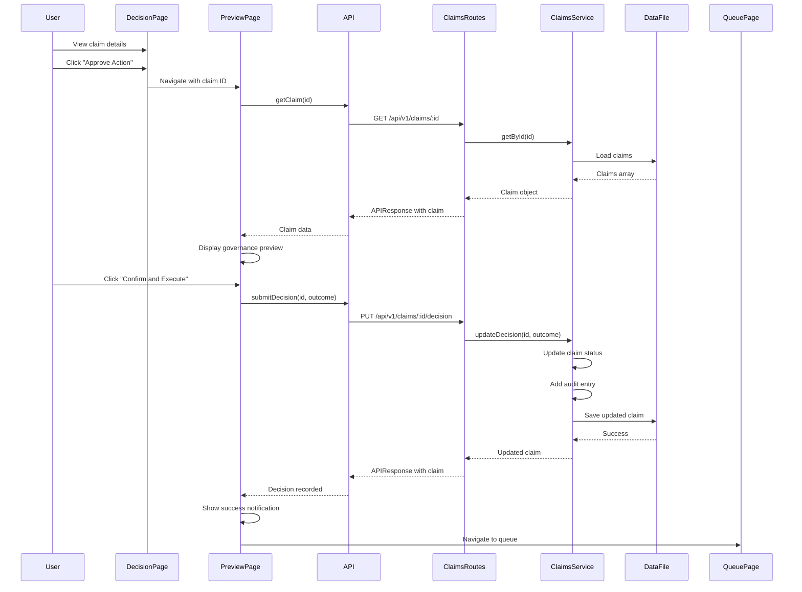

## Backend Service Architecture

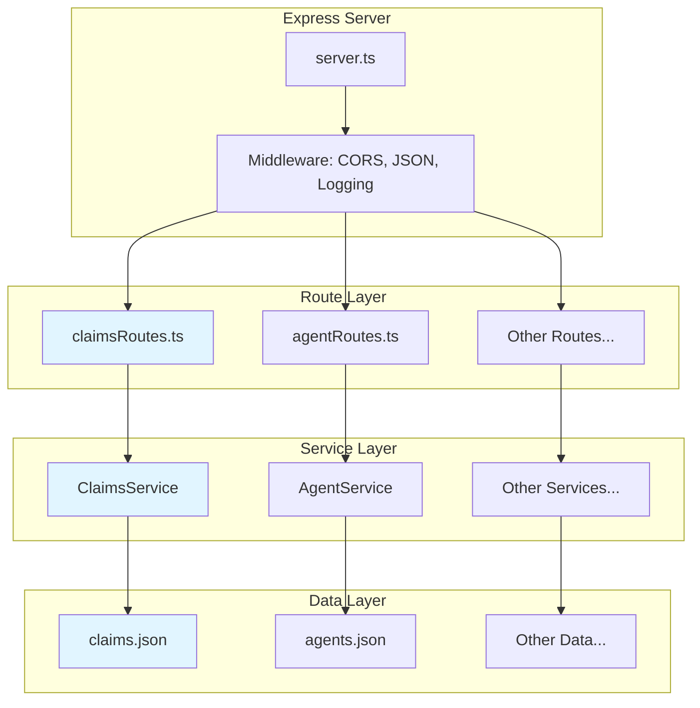

## Frontend State Management

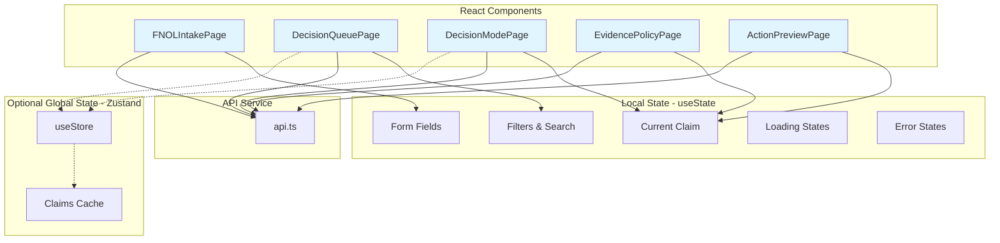

## Type System Architecture

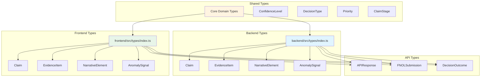

## Routing Architecture

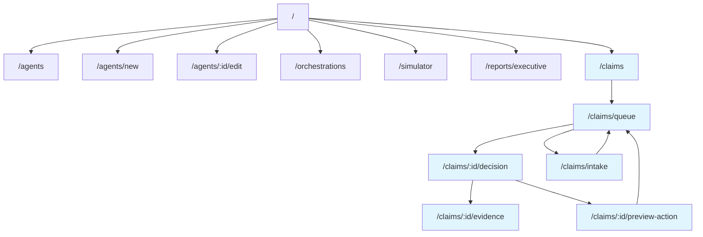

## Decision Mode Page Layout

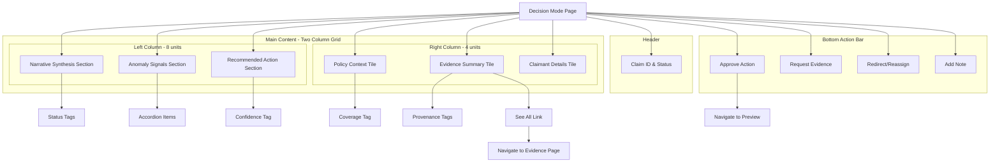

## Carbon Design System Component Usage

```mermaid
graph TB
    subgraph "Layout Components"
        GRID[Grid]
        COLUMN[Column]
        STACK[Stack]
    end
    
    subgraph "Form Components"
        FORM[Form]
        TEXT_INPUT[TextInput]
        DROPDOWN[Dropdown]
        DATE_PICKER[DatePicker]
        TIME_PICKER[TimePicker]
        TOGGLE[Toggle]
        CHECKBOX[CheckboxGroup]
        RADIO[RadioButtonGroup]
        TEXT_AREA[TextArea]
    end
    
    subgraph "Data Display"
        DATA_TABLE[DataTable]
        STRUCTURED_LIST[StructuredList]
        ACCORDION[Accordion]
        TABS[Tabs]
        CODE_SNIPPET[CodeSnippet]
    end
    
    subgraph "Feedback Components"
        TAG[Tag]
        NOTIFICATION[InlineNotification]
        LOADING[Loading]
    end
    
    subgraph "Action Components"
        BUTTON[Button]
        BUTTON_SET[ButtonSet]
    end
    
    subgraph "Container Components"
        TILE[Tile]
        HEADER[Header]
        HEADER_MENU[HeaderMenu]
    end
    
    INTAKE_PAGE[FNOLIntakePage] --> FORM
    INTAKE_PAGE --> TEXT_INPUT
    INTAKE_PAGE --> DROPDOWN
    INTAKE_PAGE --> DATE_PICKER
    INTAKE_PAGE --> TOGGLE
    INTAKE_PAGE --> CHECKBOX
    INTAKE_PAGE --> TEXT_AREA
    
    QUEUE_PAGE[DecisionQueuePage] --> DATA_TABLE
    QUEUE_PAGE --> TAG
    QUEUE_PAGE --> DROPDOWN
    
    DECISION_PAGE[DecisionModePage] --> GRID
    DECISION_PAGE --> STRUCTURED_LIST
    DECISION_PAGE --> ACCORDION
    DECISION_PAGE --> TILE
    DECISION_PAGE --> TAG
    
    EVIDENCE_PAGE[EvidencePolicyPage] --> TABS
    EVIDENCE_PAGE --> DATA_TABLE
    EVIDENCE_PAGE --> CODE_SNIPPET
    
    PREVIEW_PAGE[ActionPreviewPage] --> TILE
    PREVIEW_PAGE --> NOTIFICATION
    PREVIEW_PAGE --> BUTTON_SET
    
    APP_HEADER[AppHeader] --> HEADER
    APP_HEADER --> HEADER_MENU
```

## Error Handling Flow

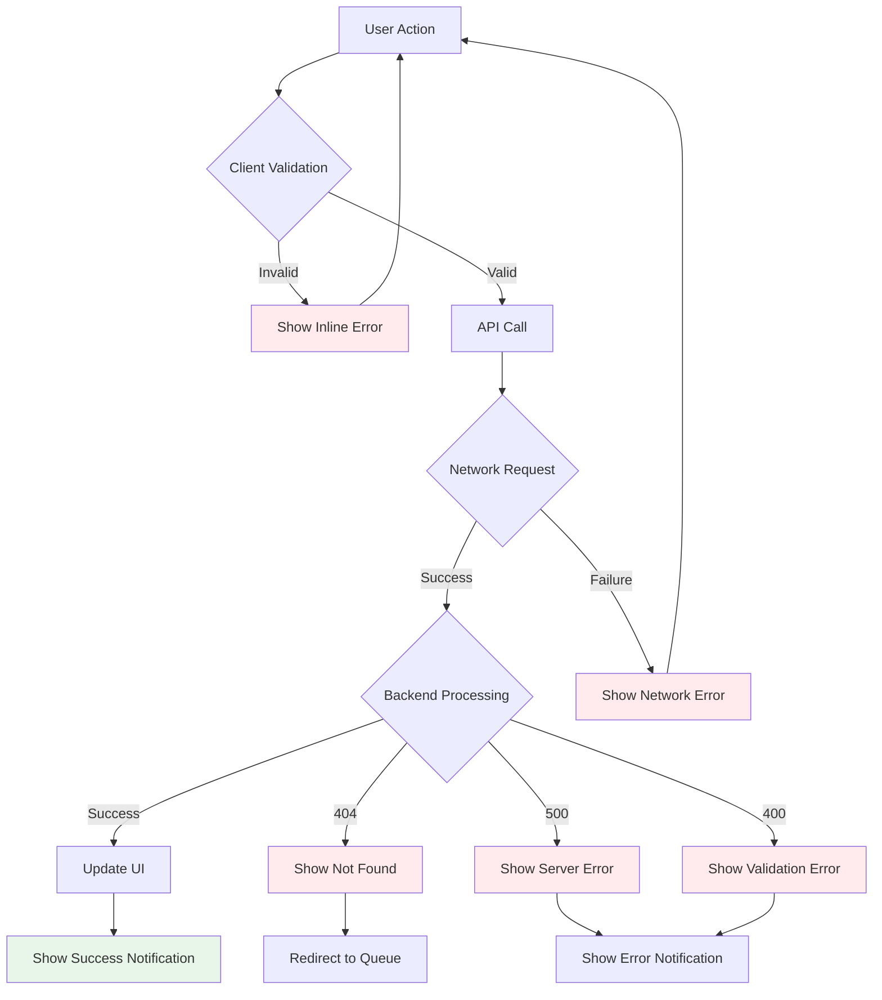

## Deployment Architecture (Future)

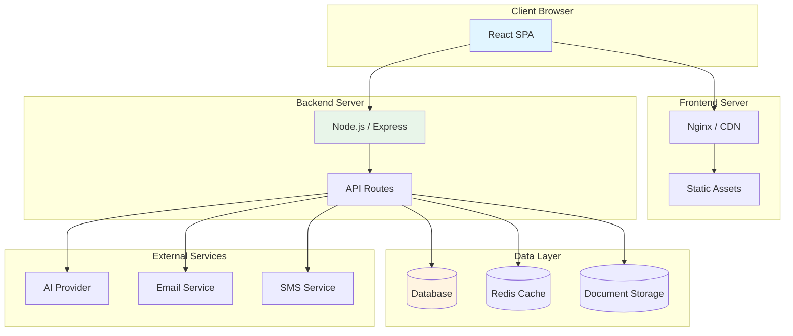

## Module Isolation Strategy

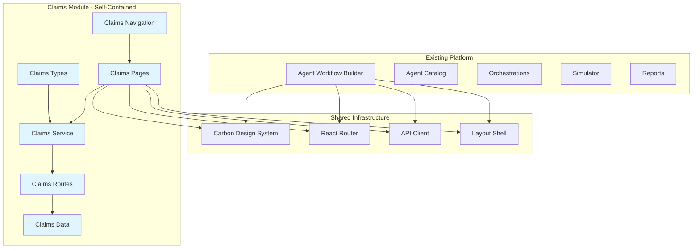

## Testing Strategy

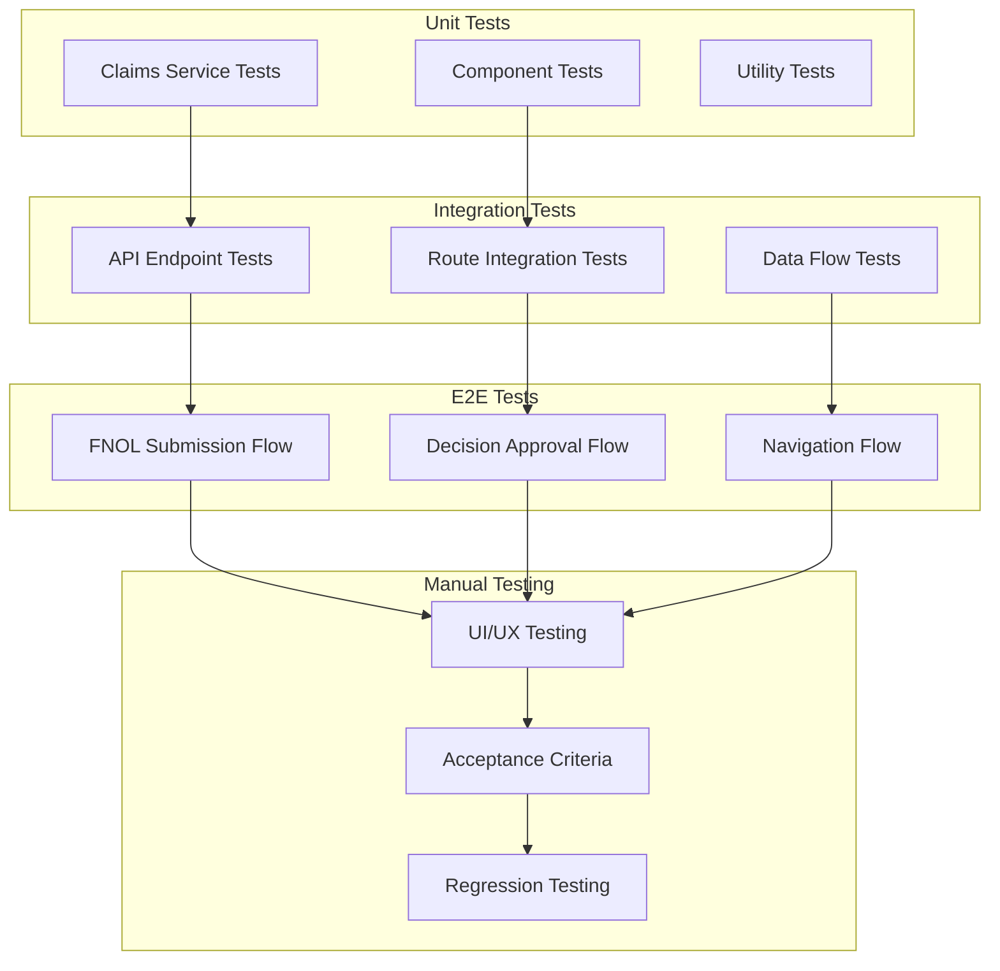

---

## Key Architectural Decisions

### 1. Self-Contained Module Design
- All claims code is isolated in dedicated files
- No modifications to existing platform code (except navigation)
- Can be removed or promoted to standalone app cleanly

### 2. Service Layer Pattern
- Business logic separated from routes
- Consistent with existing platform architecture
- Easy to swap data layer (JSON → Database)

### 3. Type Safety
- Shared types between frontend and backend
- TypeScript ensures compile-time safety
- Clear contracts for API communication

### 4. Carbon Design System
- Consistent UI/UX with existing platform
- Accessible components out of the box
- Responsive design built-in

### 5. Mock Data Approach
- Realistic scenarios for prototype
- No real AI integration required
- Easy to replace with production services

### 6. Governance Integration
- Reuses existing governance preview pattern
- Demonstrates platform extensibility
- Shows how domain apps leverage platform capabilities

---

## Extension Points for Production

### 1. Database Integration
Replace JSON file storage with:
- PostgreSQL for relational data
- MongoDB for document storage
- Redis for caching

### 2. Real-time Updates
Add WebSocket support for:
- Queue updates
- Claim status changes
- Collaborative editing

### 3. Document Management
Integrate with:
- AWS S3 for document storage
- OCR service for evidence extraction
- Document versioning

### 4. AI Integration
Connect to:
- OpenAI / Anthropic for analysis
- Custom ML models for fraud detection
- NLP for narrative synthesis

### 5. Communication Services
Integrate with:
- SendGrid for email
- Twilio for SMS
- In-app notifications

### 6. Analytics & Reporting
Add:
- Claims metrics dashboard
- Performance tracking
- Compliance reporting
- Audit trail visualization

---

## References

- **Specification**: `CLAIMS-MODULE-SPECIFICATION.md`
- **Implementation Roadmap**: `CLAIMS-IMPLEMENTATION-ROADMAP.md`
- **Carbon Design System**: https://carbondesignsystem.com/
- **Mermaid Diagrams**: https://mermaid.js.org/