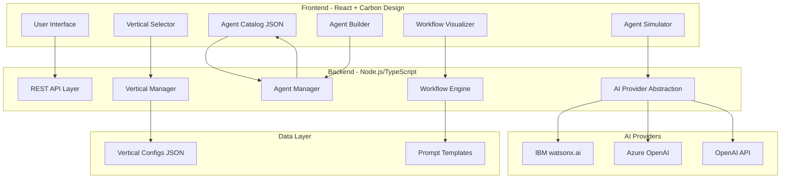
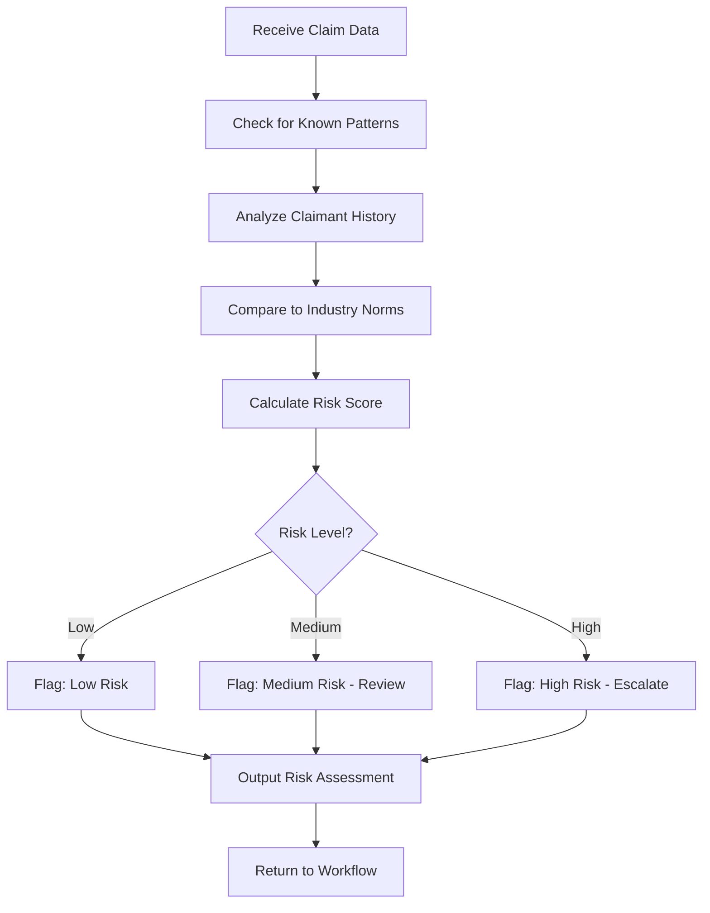

# Agent Workflow Builder - Interactive Demonstration Tool

## Executive Summary

An interactive web portal that allows users to explore, customize, and build agent-based workflows across multiple industry verticals. Built with IBM Carbon Design System, Node.js/TypeScript, and flexible AI provider integration.

---

## System Architecture

### High-Level Architecture



---

## Technology Stack

### Frontend
- **Framework**: React 18 with TypeScript
- **UI Library**: IBM Carbon Design System v11
- **State Management**: React Context + Hooks (or Zustand for complex state)
- **Visualization**: Mermaid.js for workflow diagrams
- **Code Display**: Monaco Editor (VS Code editor) for prompt viewing
- **Build Tool**: Vite for fast development

### Backend
- **Runtime**: Node.js 20+
- **Framework**: Express.js with TypeScript
- **API Style**: RESTful JSON APIs
- **Validation**: Zod for schema validation
- **AI Integration**: Custom abstraction layer supporting multiple providers

### Data Storage
- **Configuration**: JSON files (easy to edit, version control friendly)
- **Future**: Can migrate to database if needed

### Development Tools
- **Package Manager**: npm or pnpm
- **Linting**: ESLint + Prettier
- **Testing**: Vitest + React Testing Library
- **Documentation**: Markdown + Mermaid diagrams

---

## Core Features & User Flows

### 1. Vertical Selection
**User Journey:**
1. User lands on homepage
2. Sees cards for: Claims, Healthcare, Customer Service
3. Selects a vertical
4. System loads vertical-specific agent catalog and workflows

**Technical Implementation:**
- Vertical configs stored as JSON files
- Each vertical defines: name, description, default agents, sample workflows
- Dynamic loading based on selection

### 2. Agent Catalog Browser
**User Journey:**
1. User views available agents for selected vertical
2. Each agent card shows: name, purpose, inputs/outputs, authority level
3. User can click to see detailed agent definition
4. User can customize existing agent or create new one

**Technical Implementation:**
- Agent catalog as JSON with schema validation
- Carbon DataTable or Tile components for display
- Modal for detailed view with tabs: Overview, Inputs/Outputs, Governance, DSL

### 3. Agent Customization
**User Journey:**
1. User selects "Customize Agent"
2. Form appears with editable fields: purpose, inputs, outputs, constraints
3. User modifies values (e.g., "ask for policy number instead of claim number")
4. System shows preview of updated agent definition
5. User saves customized agent to workspace

**Technical Implementation:**
- Carbon Form components with validation
- Real-time preview panel
- Diff view showing changes from base agent
- Save to browser localStorage or backend

### 4. Agent Builder (No Matching Agent)
**User Journey:**
1. User describes need: "I need an agent that validates medical codes"
2. System checks catalog - no match found
3. Presents Agent Builder with pre-populated vertical context
4. User fills in: purpose, key inputs, expected outputs, decision authority
5. System generates agent definition with governance controls
6. User reviews and confirms

**Technical Implementation:**
- Natural language input field
- AI-powered suggestion engine (uses configured provider)
- Structured form with smart defaults based on vertical
- Template-based generation with validation

### 5. Workflow Visualization
**User Journey:**
1. User selects agents to include in workflow
2. System generates Mermaid diagram showing flow
3. User sees: agent nodes, decision points, escalation paths, human checkpoints
4. Interactive diagram - click nodes to see agent details
5. Export options: PNG, SVG, Mermaid code

**Technical Implementation:**
- Mermaid.js rendering
- Interactive SVG with click handlers
- DSL generator that creates valid Mermaid syntax
- Support for: flowcharts, sequence diagrams, state diagrams

### 6. Agent Simulation
**User Journey:**
1. User clicks "Simulate Agent"
2. System shows the generated prompt that would be sent to AI
3. User can see governance controls applied
4. Optional: Run simulation with test input
5. View simulated output and decision trace

**Technical Implementation:**
- Prompt template engine
- Governance rule injection
- Mock mode (no AI call) or live mode (actual AI call)
- Response formatting and visualization

---

## Data Models

### Vertical Configuration Schema

```typescript
interface VerticalConfig {
  id: string;
  name: string;
  description: string;
  icon: string;
  defaultAgents: string[]; // Agent IDs
  sampleWorkflows: WorkflowDefinition[];
  industryContext: {
    keyTerms: string[];
    commonProcesses: string[];
    regulatoryNotes: string[];
  };
}
```

### Agent Definition Schema

```typescript
interface AgentDefinition {
  id: string;
  name: string;
  archetype: string; // e.g., "Intake", "Evidence", "Fraud"
  vertical: string;
  purpose: string;
  inputs: AgentInput[];
  outputs: AgentOutput[];
  triggers: string[];
  constraints: string[];
  authorityLevel: "autonomous" | "supervised" | "human-required";
  escalationRules: EscalationRule[];
  governanceControls: GovernanceControl[];
  internalLogic?: string; // Optional DSL
  promptTemplate?: string;
}

interface AgentInput {
  name: string;
  type: string;
  required: boolean;
  description: string;
}

interface AgentOutput {
  name: string;
  type: string;
  description: string;
}

interface EscalationRule {
  condition: string;
  action: string;
  target: string; // Agent ID or "human"
}

interface GovernanceControl {
  type: "audit" | "approval" | "constraint" | "validation";
  description: string;
  enforcement: "blocking" | "warning" | "logging";
}
```

### Workflow Definition Schema

```typescript
interface WorkflowDefinition {
  id: string;
  name: string;
  description: string;
  vertical: string;
  agents: WorkflowAgent[];
  connections: WorkflowConnection[];
  mermaidDSL: string;
}

interface WorkflowAgent {
  id: string;
  agentId: string;
  position: { x: number; y: number };
  config?: Record<string, any>;
}

interface WorkflowConnection {
  from: string;
  to: string;
  condition?: string;
  label?: string;
}
```

---

## AI Provider Abstraction Layer

### Provider Interface

```typescript
interface AIProvider {
  name: string;
  generateAgentDefinition(context: AgentContext): Promise<AgentDefinition>;
  generatePrompt(agent: AgentDefinition, input: any): Promise<string>;
  simulateAgent(prompt: string): Promise<AgentResponse>;
}

interface AIProviderConfig {
  provider: "watsonx" | "azure" | "openai" | "mock";
  apiKey?: string;
  endpoint?: string;
  model?: string;
  parameters?: Record<string, any>;
}
```

### Supported Providers

1. **IBM watsonx.ai**
   - Endpoint: `https://us-south.ml.cloud.ibm.com`
   - Models: `ibm/granite-13b-chat-v2`, `meta-llama/llama-2-70b-chat`
   - Auth: IBM Cloud API Key

2. **Azure OpenAI**
   - Endpoint: Custom Azure endpoint
   - Models: `gpt-4`, `gpt-35-turbo`
   - Auth: Azure API Key

3. **OpenAI**
   - Endpoint: `https://api.openai.com/v1`
   - Models: `gpt-4`, `gpt-3.5-turbo`
   - Auth: OpenAI API Key

4. **Mock Provider**
   - Returns pre-defined responses
   - No API calls
   - Perfect for demos without credentials

---

## Project Structure

```
agent-workflow-builder/
├── frontend/
│   ├── src/
│   │   ├── components/
│   │   │   ├── VerticalSelector/
│   │   │   ├── AgentCatalog/
│   │   │   ├── AgentBuilder/
│   │   │   ├── WorkflowVisualizer/
│   │   │   ├── AgentSimulator/
│   │   │   └── common/
│   │   ├── contexts/
│   │   ├── hooks/
│   │   ├── services/
│   │   ├── types/
│   │   ├── utils/
│   │   ├── App.tsx
│   │   └── main.tsx
│   ├── public/
│   ├── package.json
│   ├── tsconfig.json
│   └── vite.config.ts
├── backend/
│   ├── src/
│   │   ├── routes/
│   │   ├── services/
│   │   │   ├── verticalService.ts
│   │   │   ├── agentService.ts
│   │   │   ├── workflowService.ts
│   │   │   └── aiProviderService.ts
│   │   ├── models/
│   │   ├── utils/
│   │   ├── config/
│   │   └── server.ts
│   ├── package.json
│   └── tsconfig.json
├── data/
│   ├── verticals/
│   │   ├── claims.json
│   │   ├── healthcare.json
│   │   └── customer-service.json
│   ├── agents/
│   │   ├── claims/
│   │   ├── healthcare/
│   │   └── customer-service/
│   └── workflows/
├── docs/
│   ├── setup.md
│   ├── architecture.md
│   ├── api-reference.md
│   └── user-guide.md
├── package.json
└── README.md
```

---

## Starter Vertical Definitions

### 1. Claims (Insurance)

**Default Agents:**
- Intake Agent
- Evidence Agent
- Fraud Agent
- Policy Agent
- Settlement Agent
- Supervising Agent
- Compliance Agent

**Sample Workflow:** FNOL → Evidence Review → Fraud Check → Policy Validation → Settlement → Approval → Closure

**Industry Context:**
- Key Terms: FNOL, Adjuster, Subrogation, Deductible, Coverage Limit
- Common Processes: First Notice of Loss, Claims Investigation, Settlement Negotiation
- Regulatory Notes: Must comply with state insurance regulations, maintain audit trail

### 2. Healthcare

**Default Agents:**
- Patient Intake Agent
- Medical Records Agent
- Authorization Agent
- Billing Agent
- Quality Assurance Agent
- Care Coordinator Agent
- Compliance Agent

**Sample Workflow:** Patient Registration → Records Review → Prior Auth → Treatment → Billing → Quality Check

**Industry Context:**
- Key Terms: ICD-10, CPT Codes, Prior Authorization, EOB, HIPAA
- Common Processes: Patient Onboarding, Insurance Verification, Medical Coding
- Regulatory Notes: HIPAA compliance required, PHI protection mandatory

### 3. Customer Service

**Default Agents:**
- Inquiry Agent
- Sentiment Analysis Agent
- Knowledge Base Agent
- Escalation Agent
- Resolution Agent
- Feedback Agent
- Quality Agent

**Sample Workflow:** Inquiry → Sentiment Check → Knowledge Lookup → Resolution or Escalation → Follow-up

**Industry Context:**
- Key Terms: SLA, CSAT, NPS, Ticket, Escalation Path
- Common Processes: Ticket Triage, Issue Resolution, Customer Feedback
- Regulatory Notes: Data privacy compliance, response time SLAs

---

## Mermaid DSL Examples

### Agent Internal Logic (Fraud Agent)



### Complete Claims Workflow

```mermaid
flowchart LR
    Start([Claim Submitted]) --> Intake[Intake Agent]
    Intake --> Evidence[Evidence Agent]
    Evidence --> Fraud[Fraud Agent]
    
    Fraud -->|Low Risk| Policy[Policy Agent]
    Fraud -->|Medium Risk| Review1[Supervisor Review]
    Fraud -->|High Risk| Review2[Supervisor + Specialist]
    
    Review1 --> Policy
    Review2 --> Policy
    
    Policy -->|Covered| Settlement[Settlement Agent]
    Policy -->|Unclear| Review3[Human Adjuster]
    Policy -->|Not Covered| Deny[Denial Process]
    
    Review3 --> Settlement
    
    Settlement -->|Under Authority| Approve[Auto-Approve]
    Settlement -->|Over Authority| Review4[Manager Approval]
    
    Review4 --> Approve
    Approve --> Compliance[Compliance Check]
    Compliance --> Close([Claim Closed])
    
    Deny --> Close
```



---

## Implementation Phases

### Phase 1: Foundation (Week 1)
- Set up project structure
- Configure IBM Carbon Design System
- Create vertical configuration system
- Build basic navigation and vertical selector
- Implement mock AI provider

### Phase 2: Agent Catalog (Week 2)
- Build agent data models and schemas
- Create agent catalog UI with Carbon components
- Implement agent detail views
- Add search and filter functionality
- Create starter agent definitions for 3 verticals

### Phase 3: Agent Builder (Week 3)
- Design agent builder form
- Implement customization interface
- Build AI-powered agent generation
- Add validation and preview
- Create prompt template system

### Phase 4: Workflow Visualization (Week 4)
- Integrate Mermaid.js
- Build workflow editor
- Create DSL generator
- Add interactive features
- Implement export functionality

### Phase 5: Simulation & Polish (Week 5)
- Build agent simulator
- Add governance visualization
- Implement AI provider abstraction
- Create documentation
- End-to-end testing

---

## Key Design Decisions

### Why IBM Carbon Design?
- Enterprise-grade UI components
- Accessibility built-in
- Consistent with IBM ecosystem
- Professional appearance for demos

### Why JSON Configuration?
- Easy to edit without code changes
- Version control friendly
- Can be generated by AI
- Simple to validate with schemas

### Why Multiple AI Providers?
- Flexibility for different environments
- No vendor lock-in
- Easy to demo without credentials (mock mode)
- Future-proof architecture

### Why Mermaid for Visualization?
- Text-based (easy to generate)
- Widely supported
- Good for demos and documentation
- Can be embedded in markdown

---

## Success Metrics

### User Experience
- User can select vertical in < 5 seconds
- Agent catalog loads in < 2 seconds
- Agent builder generates definition in < 10 seconds
- Workflow visualization renders in < 3 seconds

### Functionality
- Support 3 verticals with 5-7 agents each
- Generate valid agent definitions from natural language
- Create interactive workflow diagrams
- Simulate agent behavior with governance controls

### Technical
- Type-safe codebase (TypeScript)
- Responsive design (mobile-friendly)
- Accessible (WCAG 2.1 AA)
- Well-documented APIs

---

## Future Enhancements

### Short Term
- Add more verticals (Banking, HR, Legal)
- Export workflows as executable code
- Version control for custom agents
- Collaboration features (share workflows)

### Medium Term
- Real-time workflow execution
- Integration with actual systems
- Advanced governance rule builder
- Performance analytics dashboard

### Long Term
- Multi-agent orchestration
- Learning from execution history
- Automated workflow optimization
- Marketplace for custom agents

---

## Getting Started

### Prerequisites
- Node.js 20+
- npm or pnpm
- Modern browser (Chrome, Firefox, Safari, Edge)
- Optional: AI provider credentials (watsonx, Azure, or OpenAI)

### Quick Start
```bash
# Clone repository
git clone <repo-url>
cd agent-workflow-builder

# Install dependencies
npm install

# Configure AI provider (optional)
cp .env.example .env
# Edit .env with your credentials

# Start development servers
npm run dev

# Open browser
# Frontend: http://localhost:5173
# Backend: http://localhost:3000
```

### Configuration
Edit `config/ai-providers.json` to set your preferred AI provider:
```json
{
  "provider": "mock",
  "fallback": "mock"
}
```

Options: `watsonx`, `azure`, `openai`, `mock`

---

## Documentation Links

- [Setup Guide](docs/setup.md)
- [Architecture Details](docs/architecture.md)
- [API Reference](docs/api-reference.md)
- [User Guide](docs/user-guide.md)
- [Contributing Guidelines](docs/contributing.md)

---

## Support & Contact

For questions or issues:
- Create GitHub issue
- Contact: [your-email]
- Documentation: [docs-url]

---

*Last Updated: 2026-05-13*