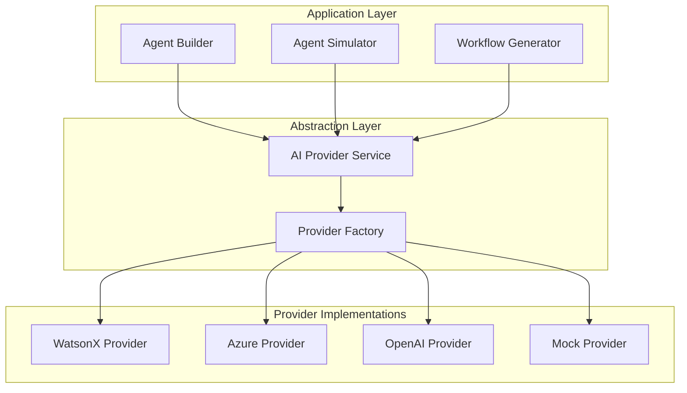

# AI Provider Integration Guide

This document describes how to integrate multiple AI providers (IBM watsonx.ai, Azure OpenAI, OpenAI, and Mock) into the Agent Workflow Builder.

---

## Architecture Overview

The AI provider integration uses an **abstraction layer** that allows seamless switching between different AI providers without changing application code.



---

## Provider Interface

All AI providers implement a common interface:

```typescript
interface AIProvider {
  // Provider identification
  name: string;
  configured: boolean;
  
  // Core operations
  generateAgent(request: AgentGenerationRequest): Promise<AgentDefinition>;
  generatePrompt(agent: AgentDefinition, input: any): Promise<string>;
  simulateAgent(prompt: string, config?: SimulationConfig): Promise<AgentResponse>;
  customizeAgent(agent: AgentDefinition, request: string): Promise<CustomizationSuggestion>;
  
  // Utility operations
  testConnection(): Promise<ConnectionTest>;
  getAvailableModels(): Promise<string[]>;
  estimateTokens(text: string): number;
}

interface AgentGenerationRequest {
  description: string;
  vertical: string;
  context: {
    existingAgents?: string[];
    requirements?: string[];
    industryContext?: any;
  };
}

interface AgentResponse {
  output: any;
  reasoning?: string;
  confidence?: number;
  metadata?: {
    model: string;
    tokens: number;
    latency: number;
  };
}

interface ConnectionTest {
  connected: boolean;
  latency: number;
  error?: string;
  models?: string[];
}
```

---

## Provider Implementations

### 1. IBM watsonx.ai Provider

**Configuration:**
```typescript
interface WatsonXConfig {
  provider: 'watsonx';
  apiKey: string;
  endpoint: string; // e.g., 'https://us-south.ml.cloud.ibm.com'
  projectId: string;
  model: string; // e.g., 'ibm/granite-13b-chat-v2'
  parameters?: {
    temperature?: number;
    maxTokens?: number;
    topP?: number;
    topK?: number;
  };
}
```

**Implementation Example:**
```typescript
class WatsonXProvider implements AIProvider {
  name = 'watsonx';
  private config: WatsonXConfig;
  
  constructor(config: WatsonXConfig) {
    this.config = config;
  }
  
  async generateAgent(request: AgentGenerationRequest): Promise<AgentDefinition> {
    const prompt = this.buildAgentGenerationPrompt(request);
    
    const response = await fetch(`${this.config.endpoint}/ml/v1/text/generation`, {
      method: 'POST',
      headers: {
        'Authorization': `Bearer ${this.config.apiKey}`,
        'Content-Type': 'application/json'
      },
      body: JSON.stringify({
        model_id: this.config.model,
        project_id: this.config.projectId,
        input: prompt,
        parameters: {
          temperature: this.config.parameters?.temperature ?? 0.7,
          max_new_tokens: this.config.parameters?.maxTokens ?? 2000,
          top_p: this.config.parameters?.topP ?? 0.9,
          top_k: this.config.parameters?.topK ?? 50
        }
      })
    });
    
    const data = await response.json();
    return this.parseAgentDefinition(data.results[0].generated_text);
  }
  
  async testConnection(): Promise<ConnectionTest> {
    const startTime = Date.now();
    try {
      const response = await fetch(`${this.config.endpoint}/ml/v1/foundation_model_specs`, {
        headers: {
          'Authorization': `Bearer ${this.config.apiKey}`
        }
      });
      
      if (!response.ok) {
        throw new Error(`Connection failed: ${response.statusText}`);
      }
      
      const data = await response.json();
      const models = data.resources?.map((r: any) => r.model_id) || [];
      
      return {
        connected: true,
        latency: Date.now() - startTime,
        models
      };
    } catch (error) {
      return {
        connected: false,
        latency: Date.now() - startTime,
        error: error.message
      };
    }
  }
}
```

**Authentication:**
- Requires IBM Cloud API Key
- Obtain from: https://cloud.ibm.com/iam/apikeys
- Project ID from watsonx.ai project settings

**Available Models:**
- `ibm/granite-13b-chat-v2` - IBM's Granite model
- `meta-llama/llama-2-70b-chat` - Meta's Llama 2
- `google/flan-ul2` - Google's FLAN-UL2
- `bigscience/mt0-xxl` - BigScience MT0

---

### 2. Azure OpenAI Provider

**Configuration:**
```typescript
interface AzureOpenAIConfig {
  provider: 'azure';
  apiKey: string;
  endpoint: string; // e.g., 'https://your-resource.openai.azure.com'
  deploymentName: string; // Your deployment name
  apiVersion: string; // e.g., '2024-02-15-preview'
  parameters?: {
    temperature?: number;
    maxTokens?: number;
    topP?: number;
  };
}
```

**Implementation Example:**
```typescript
class AzureOpenAIProvider implements AIProvider {
  name = 'azure';
  private config: AzureOpenAIConfig;
  
  constructor(config: AzureOpenAIConfig) {
    this.config = config;
  }
  
  async generateAgent(request: AgentGenerationRequest): Promise<AgentDefinition> {
    const prompt = this.buildAgentGenerationPrompt(request);
    
    const url = `${this.config.endpoint}/openai/deployments/${this.config.deploymentName}/chat/completions?api-version=${this.config.apiVersion}`;
    
    const response = await fetch(url, {
      method: 'POST',
      headers: {
        'api-key': this.config.apiKey,
        'Content-Type': 'application/json'
      },
      body: JSON.stringify({
        messages: [
          {
            role: 'system',
            content: 'You are an expert at designing AI agents for business workflows.'
          },
          {
            role: 'user',
            content: prompt
          }
        ],
        temperature: this.config.parameters?.temperature ?? 0.7,
        max_tokens: this.config.parameters?.maxTokens ?? 2000,
        top_p: this.config.parameters?.topP ?? 0.9
      })
    });
    
    const data = await response.json();
    return this.parseAgentDefinition(data.choices[0].message.content);
  }
  
  async testConnection(): Promise<ConnectionTest> {
    const startTime = Date.now();
    try {
      const url = `${this.config.endpoint}/openai/deployments?api-version=${this.config.apiVersion}`;
      const response = await fetch(url, {
        headers: {
          'api-key': this.config.apiKey
        }
      });
      
      if (!response.ok) {
        throw new Error(`Connection failed: ${response.statusText}`);
      }
      
      const data = await response.json();
      const models = data.data?.map((d: any) => d.model) || [];
      
      return {
        connected: true,
        latency: Date.now() - startTime,
        models
      };
    } catch (error) {
      return {
        connected: false,
        latency: Date.now() - startTime,
        error: error.message
      };
    }
  }
}
```

**Authentication:**
- Requires Azure OpenAI API Key
- Obtain from: Azure Portal → Your OpenAI Resource → Keys and Endpoint
- Deployment name from: Azure Portal → Your OpenAI Resource → Deployments

**Available Models:**
- `gpt-4` - Most capable model
- `gpt-4-32k` - Extended context window
- `gpt-35-turbo` - Fast and cost-effective
- `gpt-35-turbo-16k` - Extended context

---

### 3. OpenAI Provider

**Configuration:**
```typescript
interface OpenAIConfig {
  provider: 'openai';
  apiKey: string;
  model: string; // e.g., 'gpt-4', 'gpt-3.5-turbo'
  organization?: string;
  parameters?: {
    temperature?: number;
    maxTokens?: number;
    topP?: number;
  };
}
```

**Implementation Example:**
```typescript
class OpenAIProvider implements AIProvider {
  name = 'openai';
  private config: OpenAIConfig;
  
  constructor(config: OpenAIConfig) {
    this.config = config;
  }
  
  async generateAgent(request: AgentGenerationRequest): Promise<AgentDefinition> {
    const prompt = this.buildAgentGenerationPrompt(request);
    
    const response = await fetch('https://api.openai.com/v1/chat/completions', {
      method: 'POST',
      headers: {
        'Authorization': `Bearer ${this.config.apiKey}`,
        'Content-Type': 'application/json',
        ...(this.config.organization && { 'OpenAI-Organization': this.config.organization })
      },
      body: JSON.stringify({
        model: this.config.model,
        messages: [
          {
            role: 'system',
            content: 'You are an expert at designing AI agents for business workflows.'
          },
          {
            role: 'user',
            content: prompt
          }
        ],
        temperature: this.config.parameters?.temperature ?? 0.7,
        max_tokens: this.config.parameters?.maxTokens ?? 2000,
        top_p: this.config.parameters?.topP ?? 0.9
      })
    });
    
    const data = await response.json();
    return this.parseAgentDefinition(data.choices[0].message.content);
  }
  
  async testConnection(): Promise<ConnectionTest> {
    const startTime = Date.now();
    try {
      const response = await fetch('https://api.openai.com/v1/models', {
        headers: {
          'Authorization': `Bearer ${this.config.apiKey}`,
          ...(this.config.organization && { 'OpenAI-Organization': this.config.organization })
        }
      });
      
      if (!response.ok) {
        throw new Error(`Connection failed: ${response.statusText}`);
      }
      
      const data = await response.json();
      const models = data.data?.map((d: any) => d.id) || [];
      
      return {
        connected: true,
        latency: Date.now() - startTime,
        models
      };
    } catch (error) {
      return {
        connected: false,
        latency: Date.now() - startTime,
        error: error.message
      };
    }
  }
}
```

**Authentication:**
- Requires OpenAI API Key
- Obtain from: https://platform.openai.com/api-keys
- Optional organization ID for team accounts

**Available Models:**
- `gpt-4` - Most capable
- `gpt-4-turbo-preview` - Latest GPT-4 with improvements
- `gpt-3.5-turbo` - Fast and cost-effective
- `gpt-3.5-turbo-16k` - Extended context

---

### 4. Mock Provider

**Configuration:**
```typescript
interface MockConfig {
  provider: 'mock';
  delay?: number; // Simulate API latency (ms)
  failureRate?: number; // Simulate failures (0-1)
}
```

**Implementation Example:**
```typescript
class MockProvider implements AIProvider {
  name = 'mock';
  private config: MockConfig;
  
  constructor(config: MockConfig = {}) {
    this.config = config;
  }
  
  async generateAgent(request: AgentGenerationRequest): Promise<AgentDefinition> {
    await this.simulateDelay();
    
    // Return pre-defined agent based on description
    return {
      id: `mock-agent-${Date.now()}`,
      name: this.extractAgentName(request.description),
      archetype: this.inferArchetype(request.description),
      vertical: request.vertical,
      purpose: request.description,
      inputs: [
        {
          name: 'input',
          type: 'object',
          required: true,
          description: 'Input data'
        }
      ],
      outputs: [
        {
          name: 'output',
          type: 'object',
          description: 'Output data'
        }
      ],
      triggers: ['event_triggered'],
      constraints: ['Must follow business rules'],
      authorityLevel: 'supervised',
      escalationRules: [],
      governanceControls: [
        {
          type: 'audit',
          description: 'Log all operations',
          enforcement: 'blocking'
        }
      ]
    };
  }
  
  async simulateAgent(prompt: string): Promise<AgentResponse> {
    await this.simulateDelay();
    
    return {
      output: {
        decision: 'Mock decision',
        confidence: 0.85,
        reasoning: 'This is a mock response for demonstration purposes'
      },
      reasoning: 'Mock reasoning',
      confidence: 0.85,
      metadata: {
        model: 'mock-model',
        tokens: 100,
        latency: this.config.delay || 500
      }
    };
  }
  
  async testConnection(): Promise<ConnectionTest> {
    await this.simulateDelay();
    
    return {
      connected: true,
      latency: this.config.delay || 100,
      models: ['mock-model-v1', 'mock-model-v2']
    };
  }
  
  private async simulateDelay(): Promise<void> {
    const delay = this.config.delay || 500;
    await new Promise(resolve => setTimeout(resolve, delay));
  }
  
  private extractAgentName(description: string): string {
    // Simple extraction logic
    const match = description.match(/agent (?:that |to )?(.+?)(?:\.|$)/i);
    return match ? match[1].trim() : 'Custom Agent';
  }
  
  private inferArchetype(description: string): string {
    const lower = description.toLowerCase();
    if (lower.includes('intake') || lower.includes('gather')) return 'Intake';
    if (lower.includes('evidence') || lower.includes('review')) return 'Evidence';
    if (lower.includes('fraud') || lower.includes('risk')) return 'Fraud';
    if (lower.includes('policy') || lower.includes('coverage')) return 'Policy';
    if (lower.includes('settlement') || lower.includes('resolution')) return 'Settlement';
    if (lower.includes('supervisor') || lower.includes('oversight')) return 'Supervisor';
    if (lower.includes('compliance') || lower.includes('audit')) return 'Compliance';
    return 'Custom';
  }
}
```

---

## Provider Factory

```typescript
class AIProviderFactory {
  static create(config: AIProviderConfig): AIProvider {
    switch (config.provider) {
      case 'watsonx':
        return new WatsonXProvider(config as WatsonXConfig);
      case 'azure':
        return new AzureOpenAIProvider(config as AzureOpenAIConfig);
      case 'openai':
        return new OpenAIProvider(config as OpenAIConfig);
      case 'mock':
        return new MockProvider(config as MockConfig);
      default:
        throw new Error(`Unknown provider: ${config.provider}`);
    }
  }
}
```

---

## AI Service Layer

```typescript
class AIProviderService {
  private provider: AIProvider;
  private config: AIProviderConfig;
  
  constructor(config: AIProviderConfig) {
    this.config = config;
    this.provider = AIProviderFactory.create(config);
  }
  
  async generateAgent(request: AgentGenerationRequest): Promise<AgentDefinition> {
    try {
      const agent = await this.provider.generateAgent(request);
      
      // Post-process and validate
      return this.validateAndEnhanceAgent(agent, request);
    } catch (error) {
      console.error('Agent generation failed:', error);
      throw new Error(`Failed to generate agent: ${error.message}`);
    }
  }
  
  async simulateAgent(agentId: string, input: any): Promise<SimulationResult> {
    // Load agent definition
    const agent = await this.loadAgent(agentId);
    
    // Generate prompt
    const prompt = await this.provider.generatePrompt(agent, input);
    
    // Simulate execution
    const response = await this.provider.simulateAgent(prompt);
    
    // Apply governance checks
    const governanceChecks = this.applyGovernanceControls(agent, response);
    
    return {
      output: response.output,
      executionTime: response.metadata?.latency || 0,
      governanceChecks,
      escalations: this.checkEscalations(agent, response)
    };
  }
  
  async switchProvider(newConfig: AIProviderConfig): Promise<void> {
    this.config = newConfig;
    this.provider = AIProviderFactory.create(newConfig);
  }
  
  private validateAndEnhanceAgent(agent: AgentDefinition, request: AgentGenerationRequest): AgentDefinition {
    // Add vertical context
    agent.vertical = request.vertical;
    
    // Ensure required fields
    if (!agent.inputs || agent.inputs.length === 0) {
      agent.inputs = [{ name: 'input', type: 'object', required: true, description: 'Input data' }];
    }
    
    if (!agent.outputs || agent.outputs.length === 0) {
      agent.outputs = [{ name: 'output', type: 'object', description: 'Output data' }];
    }
    
    // Add default governance controls if missing
    if (!agent.governanceControls || agent.governanceControls.length === 0) {
      agent.governanceControls = [
        {
          type: 'audit',
          description: 'Log all operations',
          enforcement: 'blocking'
        }
      ];
    }
    
    return agent;
  }
  
  private applyGovernanceControls(agent: AgentDefinition, response: AgentResponse): GovernanceCheck[] {
    return agent.governanceControls.map(control => ({
      type: control.type,
      status: 'passed',
      message: `${control.description} - Verified`
    }));
  }
  
  private checkEscalations(agent: AgentDefinition, response: AgentResponse): Escalation[] {
    const escalations: Escalation[] = [];
    
    for (const rule of agent.escalationRules || []) {
      if (this.evaluateCondition(rule.condition, response)) {
        escalations.push({
          triggered: true,
          rule: rule.condition,
          target: rule.target,
          action: rule.action
        });
      }
    }
    
    return escalations;
  }
  
  private evaluateCondition(condition: string, response: AgentResponse): boolean {
    // Simple condition evaluation (can be enhanced)
    try {
      const func = new Function('response', `return ${condition}`);
      return func(response);
    } catch {
      return false;
    }
  }
}
```

---

## Configuration Management

### Environment Variables

```bash
# .env file
AI_PROVIDER=mock

# WatsonX Configuration
WATSONX_API_KEY=your-api-key
WATSONX_ENDPOINT=https://us-south.ml.cloud.ibm.com
WATSONX_PROJECT_ID=your-project-id
WATSONX_MODEL=ibm/granite-13b-chat-v2

# Azure OpenAI Configuration
AZURE_OPENAI_API_KEY=your-api-key
AZURE_OPENAI_ENDPOINT=https://your-resource.openai.azure.com
AZURE_OPENAI_DEPLOYMENT=your-deployment-name
AZURE_OPENAI_API_VERSION=2024-02-15-preview

# OpenAI Configuration
OPENAI_API_KEY=your-api-key
OPENAI_MODEL=gpt-4
OPENAI_ORGANIZATION=your-org-id
```

### Configuration File

```json
{
  "aiProvider": {
    "provider": "mock",
    "fallback": "mock",
    "timeout": 30000,
    "retries": 3
  },
  "providers": {
    "watsonx": {
      "endpoint": "${WATSONX_ENDPOINT}",
      "projectId": "${WATSONX_PROJECT_ID}",
      "model": "ibm/granite-13b-chat-v2",
      "parameters": {
        "temperature": 0.7,
        "maxTokens": 2000
      }
    },
    "azure": {
      "endpoint": "${AZURE_OPENAI_ENDPOINT}",
      "deploymentName": "${AZURE_OPENAI_DEPLOYMENT}",
      "apiVersion": "2024-02-15-preview",
      "parameters": {
        "temperature": 0.7,
        "maxTokens": 2000
      }
    },
    "openai": {
      "model": "gpt-4",
      "parameters": {
        "temperature": 0.7,
        "maxTokens": 2000
      }
    },
    "mock": {
      "delay": 500,
      "failureRate": 0
    }
  }
}
```

---

## Prompt Engineering

### Agent Generation Prompt Template

```typescript
const AGENT_GENERATION_PROMPT = `You are an expert at designing AI agents for business workflows.

Create a detailed agent definition based on the following requirements:

Description: {description}
Industry Vertical: {vertical}
Existing Agents: {existingAgents}
Requirements: {requirements}

Industry Context:
{industryContext}

Generate a complete agent definition in JSON format with the following structure:
- name: Clear, descriptive name
- archetype: One of: Intake, Evidence, Fraud, Policy, Settlement, Supervisor, Compliance
- purpose: Clear statement of the agent's role
- inputs: Array of required inputs with types and descriptions
- outputs: Array of outputs the agent produces
- triggers: Events that activate this agent
- constraints: Limitations and rules the agent must follow
- authorityLevel: autonomous, supervised, or human-required
- escalationRules: Conditions that trigger escalation
- governanceControls: Audit, approval, and validation controls

Ensure the agent:
1. Aligns with industry best practices for {vertical}
2. Has clear inputs and outputs
3. Includes appropriate governance controls
4. Defines escalation paths for edge cases
5. Follows the principle of least privilege

Return ONLY valid JSON, no additional text.`;
```

### Simulation Prompt Template

```typescript
const SIMULATION_PROMPT = `You are simulating the behavior of an AI agent in a business workflow.

Agent Definition:
Name: {agentName}
Purpose: {agentPurpose}
Authority Level: {authorityLevel}

Constraints:
{constraints}

Input Data:
{inputData}

Governance Controls:
{governanceControls}

Based on the agent definition and input data:
1. Process the input according to the agent's purpose
2. Apply all constraints
3. Make a decision within the agent's authority level
4. Provide clear reasoning
5. Flag any escalations needed
6. Return confidence score

Return response in JSON format:
{
  "decision": "your decision",
  "reasoning": "detailed explanation",
  "confidence": 0.85,
  "escalations": [],
  "nextSteps": []
}`;
```

---

## Error Handling

```typescript
class AIProviderError extends Error {
  constructor(
    message: string,
    public provider: string,
    public code: string,
    public details?: any
  ) {
    super(message);
    this.name = 'AIProviderError';
  }
}

// Usage
try {
  const agent = await aiService.generateAgent(request);
} catch (error) {
  if (error instanceof AIProviderError) {
    console.error(`Provider ${error.provider} failed:`, error.message);
    // Try fallback provider
    await aiService.switchProvider({ provider: 'mock' });
    const agent = await aiService.generateAgent(request);
  }
}
```

---

## Testing

### Unit Tests

```typescript
describe('AIProviderService', () => {
  it('should generate agent with mock provider', async () => {
    const service = new AIProviderService({ provider: 'mock' });
    const agent = await service.generateAgent({
      description: 'An agent that validates claims',
      vertical: 'claims',
      context: {}
    });
    
    expect(agent).toBeDefined();
    expect(agent.name).toBeTruthy();
    expect(agent.vertical).toBe('claims');
  });
  
  it('should switch providers', async () => {
    const service = new AIProviderService({ provider: 'mock' });
    await service.switchProvider({ provider: 'openai', apiKey: 'test' });
    expect(service.getCurrentProvider()).toBe('openai');
  });
});
```

---

## Best Practices

1. **Always use Mock provider for development** - No API costs, fast iteration
2. **Implement retry logic** - Handle transient failures
3. **Cache responses** - Reduce API calls and costs
4. **Monitor token usage** - Track costs across providers
5. **Validate responses** - Ensure generated agents are valid
6. **Use fallback providers** - Graceful degradation
7. **Log all AI interactions** - Debugging and audit trail
8. **Rate limit requests** - Respect provider limits
9. **Secure API keys** - Never commit to version control
10. **Test with real providers** - Before production deployment

---

*Last Updated: 2026-05-13*