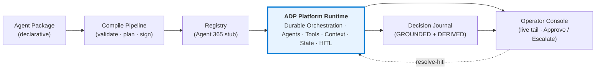
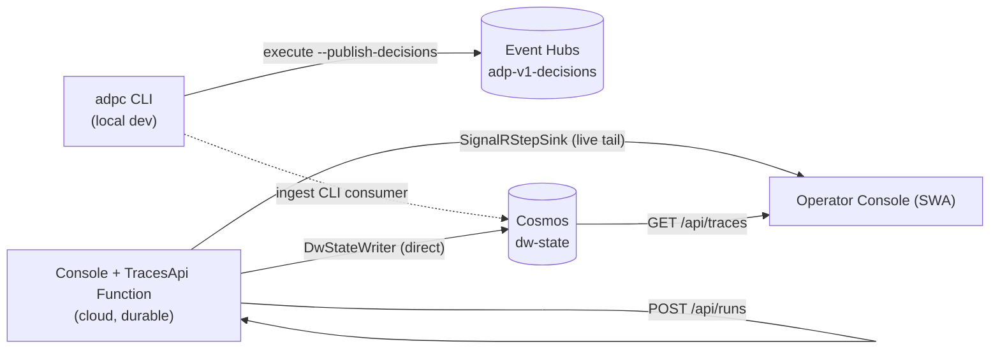
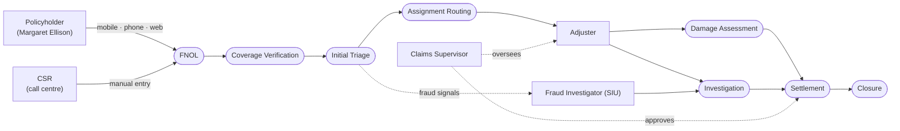
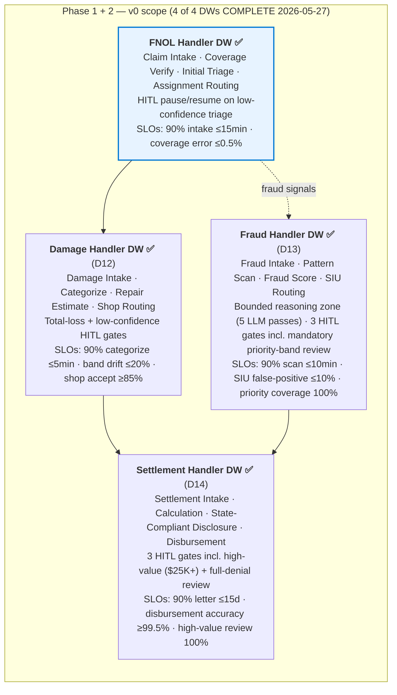
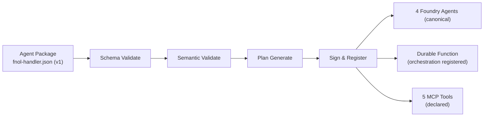
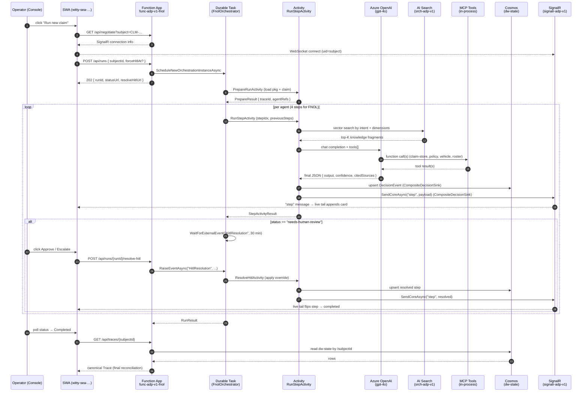

# Architecture — adp-v1

**Refreshed 2026-05-27 to reflect what's actually deployed and running.**

Three views, intentionally separate:

1. **Platform** — what ADP is, independent of any use case.
2. **Meridian use case** — what P&C Auto Claims looks like in business terms, independent of platform.
3. **Integration** — how the Meridian use case sits on the ADP platform.

Each view answers a different question. Each is annotated with **what's built** vs **what's specced-but-deferred** so the gap is honest. See §4 for the Fabric semantic layer (now live as of D11).

> All diagrams are mermaid. View in VS Code (`Ctrl+K V` for preview) or [mermaid.live](https://mermaid.live).

---

## View 1 — ADP Platform (no use case)

### 1.1 Conceptual frame

The platform is a self-contained, Azure-native, Microsoft-first agentic application runtime. It accepts an **agent package** (declarative DW + agents + skills + tools + orchestration + governance), compiles it, registers it, executes it under Durable orchestration, and emits an auditable decision trace with HITL pause/resume.

### 1.2 Ten-layer architecture — actual current state

Status legend: ✅ built · 🟡 minimal / stub · ⏸ deferred (specced in ADR but not yet built)

```mermaid
flowchart TB
  subgraph L1["L1 — Identity &amp; Governance"]
    direction LR
    Entra["Entra ID + Entra Agent ID (stub)"]
    DefAI["Defender for AI ⏸"]
    Pur["Purview ⏸"]
    Sent["Sentinel ⏸"]
    Agt365["Agent 365 registry (stub)"]
  end

  subgraph L2["L2 — Experience"]
    direction LR
    Cons["<b>Operator Console ✅</b><br/>Vite + React 19 + Fluent UI v9<br/>Live tail + HITL UX"]
    TC["Teams Cards ⏸"]
    M365["M365 Copilot Pages ⏸"]
  end

  subgraph L3["L3 — Agent Runtime"]
    direction LR
    AgFx["FoundryAdapter ✅<br/>(Azure OpenAI chat-completions<br/>+ function calling)"]
    FAS["Foundry Agent Service 🟡<br/>(today: AOAI chat-completions;<br/>per-agent Entra IDs deferred)"]
    FL["Foundry Local ⏸"]
    MCP["MCP tools ✅<br/>(4 in-process tools)"]
    A2A["A2A ⏸"]
  end

  subgraph L4["L4 — Orchestration"]
    direction LR
    Aspire[".NET Aspire ⏸<br/>(deferred; not strictly needed)"]
    Durable["<b>Durable Functions ✅</b><br/>FnolOrchestrator + 3 activities<br/>HITL pause/resume"]
    Logic["Logic Apps ⏸"]
  end

  subgraph L5["L5 — Context Layer"]
    direction LR
    FabricIQ["<b>Fabric IQ ✅</b><br/>Fabric Lakehouse SQL endpoint<br/>(SEMANTIC_BACKEND=fabric)<br/>SQL fallback ✅ retained"]
    FoundryIQ["<b>Foundry IQ ✅</b><br/>(Azure AI Search vector,<br/>3072-d embeddings,<br/>19 P&amp;C docs)"]
    WorkIQ["<b>Work IQ ✅</b><br/>Synthetic-but-deterministic v0<br/>(ADR-0012; Graph v1)"]
    AISearch["Azure AI Search ✅"]
    Gremlin["Cosmos Gremlin ⏸"]
  end

  subgraph L6["L6 — State &amp; Events"]
    direction LR
    Cos["<b>Cosmos DB ✅</b><br/>adp.dw-state<br/>partition /subjectId"]
    EH["<b>Event Hubs ✅</b><br/>(Kafka API)<br/>adp-v1-decisions"]
    EG["Event Grid ✅<br/>(provisioned, idle)"]
    Sig["<b>SignalR Service ✅</b><br/>Free_F1 Serverless<br/>hub fnoltrace"]
  end

  subgraph L7["L7 — Data Substrate"]
    direction LR
    Bronze["Fabric Bronze ⏸"]
    Silver["Fabric Silver ⏸"]
    Gold["<b>Fabric Lakehouse (Gold) ✅</b><br/>Workspace adp-v1<br/>3 Delta tables (1K rows ea.)"]
    RTI["Fabric RTI ⏸"]
    DB["Databricks ⏸"]
    AOAI["<b>Azure OpenAI ✅</b><br/>(reused dt-navigator-openai;<br/>gpt-4o + text-embedding-3-large)"]
  end

  subgraph L8["L8 — Compute &amp; Hosting"]
    direction LR
    CA["Container Apps env ✅<br/>(provisioned, no apps yet)"]
    Fn["<b>Azure Functions ✅</b><br/>Flex Consumption, .NET 10 isolated<br/>10 functions hosted"]
    SWA["<b>Static Web App ✅</b><br/>(Free tier)"]
    AKS["AKS ⏸"]
  end

  subgraph L9["L9 — IaC &amp; Automation"]
    direction LR
    Bicep["<b>Bicep ✅</b><br/>(11 modules, 18 of 19 resources)"]
    TF["Terraform (HashiCorp) ⏸"]
    Ansi["Ansible ⏸"]
    GHA["GitHub Actions ⏸"]
  end

  subgraph L10["L10 — Optional Integration"]
    direction LR
    Confluent["Confluent Kafka ⏸"]
    Vault["HashiCorp Vault ⏸"]
    ARO["Red Hat OpenShift ⏸"]
    Wx["watsonx.data ⏸"]
  end

  L2 --> L3
  L3 --> L4
  L3 --> L5
  L4 --> L6
  L5 --> L6
  L6 --> L7
  L7 --> L8
  L1 -. governs .-> L2
  L1 -. governs .-> L3
  L1 -. governs .-> L4
  L1 -. governs .-> L5
  L9 -. provisions .-> L8
```

### 1.3 What's built — concrete inventory

| Layer | What's real now | Resource / Code |
|---|---|---|
| L1 | Entra Agent ID (stub-bound) | Bicep + Agent 365 stub registry |
| L2 | Operator Console at SWA | `swa-adp-v1-console`, https://witty-sea-0d12a380f.7.azurestaticapps.net |
| L3 | FoundryAdapter (gpt-4o), 4 MCP tools (claim-store, vehicle-lookup, policy-store, adjuster-roster), function-calling loop | `platform/src/Agents/`, `platform/src/ToolRuntime/` |
| L4 | Durable Function FnolOrchestrator with per-step activities + HITL pause/resume via `WaitForExternalEvent` | `platform/src/TracesApi/Functions/` |
| L5 | Foundry IQ = Azure AI Search index `adp-knowledge` (19 docs, 3072-d). Fabric IQ = Fabric Lakehouse `adp` (D11) with Azure SQL fallback (D10). Work IQ = synthetic-deterministic source (ADR-0012; Graph v1) | `srch-adp-v1`, workspace `adp-v1`, `platform/src/ContextLayer/` |
| L6 | Cosmos `adp.dw-state` + Event Hubs (Kafka API) `adp-v1-decisions` + SignalR `signalr-adp-v1` | `cdb-adp-v1`, `evh-adp-v1`, `signalr-adp-v1` |
| L7 | Azure OpenAI reused (`dt-navigator-openai`); medallion deferred (see §4) | external |
| L8 | Functions Flex Consumption (10 functions hosted) + SWA Free | `func-adp-v1-fnol`, `swa-adp-v1-console` |
| L9 | Bicep templates for 18 of 19 resources; one Bicep delta documented in DEPLOY.md | `platform/infra/` |

### 1.4 Two execution paths (still co-exist)

The cloud path is the production shape. The CLI path stays useful for local dev + experimentation. Both converge on Cosmos via the `IDecisionSink` interface.

---

## View 2 — Meridian P&C Auto Claims (business view, no platform)

### 2.1 Personas and the journey

### 2.2 Meridian AS-IS systems

| System | Role | Status in v0 |
|---|---|---|
| Duck Creek | Policy admin + claim system of record | Simulated via synthetic 1K corpus, Duck-Creek-shaped |
| PeopleSoft | HR / adjuster roster | Synthesised on-the-fly by `adjuster-roster` MCP tool |
| Oracle EBS | Finance / payments backend | Out of v0 |
| ServiceNow | Service management | Out of v0 |
| Digital payments | Settlement disbursement | Out of v0 |

### 2.3 Domain decomposition — 4 Digital Workers

### 2.4 v0 use-case scope

**In:** Full claim lifecycle across **4 DWs**: FNOL Handler (Intake → Coverage → Triage → Assignment) → Damage Handler (Intake → Categorize → Estimate → Shop Routing) → Fraud Handler (Intake → Pattern Scan → Score → SIU Routing) → Settlement Handler (Intake → Calculation → State-Compliant Disclosure → Disbursement). HITL pause/resume on both confidence-based triggers (e.g. `step.X.confidence < 0.6`) and field-value triggers (e.g. `step.damage_categorization.totalLossSuspect == true`, `step.fraud_score.fraudBand == 'siu-priority'`, `step.settlement_calculation.highValueSettlement == true`, `step.settlement_disclosure.fullDenial == true`). Single happy path on synthetic data.

**Out:** Closure (claim file archival), customer contact centre, audit/monitoring, medical claims, legal escalations, multi-claim concurrency, real Duck Creek/Guidewire integration.

### 2.5 Knowledge corpus (Foundry IQ)

19 markdown documents under `usecases/meridian-pnc-auto-claims/knowledge/`, indexed into `srch-adp-v1`:

| Doc | Topic | Dimensions |
|---|---|---|
| PAC-COV-001 | Personal Auto Policy — Coverage Sections | procedural, regulatory |
| PAC-COV-002 | Coverage Verification Rules + Exclusions | procedural, regulatory |
| PAC-TRI-001 | Initial Triage — Severity Classification | procedural, historical |
| PAC-FRD-001 | Fraud Indicators (NAIC-style) | procedural, historical |
| PAC-ROUTE-001 | Adjuster Assignment Policy | procedural, collaboration |
| PAC-REG-001 | NAIC Unfair Claims Practices | regulatory |
| PAC-INTAKE-001 | FNOL Field Extraction Standards | procedural, entity |
| PAC-REG-002 | State-Specific Rideshare / TNC Rules | regulatory, procedural |
| **PAC-DAMAGE-001** (D12) | Damage Categorization Framework | procedural, historical |
| **PAC-DAMAGE-002** (D12) | Repair Cost Estimation Bands | procedural, historical |
| **PAC-DAMAGE-003** (D12) | Safety Re-inspection Triggers | procedural, regulatory |
| **PAC-SHOP-001** (D12) | Repair Shop Network — Selection Policy | procedural, collaboration |
| **PAC-TOTAL-LOSS-001** (D12) | Total-Loss Threshold Rules | procedural, regulatory |
| **PAC-FRD-002** (D13) | Fraud Pattern Detection — Clustering, Rings, Sequences | procedural, historical |
| **PAC-FRD-003** (D13) | Fraud Score — Composition + Thresholds + Bands | procedural, regulatory |
| **PAC-SIU-001** (D13) | SIU Referral Procedure + Investigator Routing | procedural, collaboration, regulatory |
| **PAC-SET-001** (D14) | Settlement Amount Calculation — ACV, Repair, Deductibles | procedural, regulatory |
| **PAC-SET-002** (D14) | Settlement Disclosure — State-Specific Language + Appeal Rights | regulatory, procedural |
| **PAC-SET-003** (D14) | Payment Channel + Recipient Routing | procedural, collaboration |

---

## View 3 — Integration (Meridian on ADP)

This view answers: **what happens end-to-end when the Run button is clicked.**

### 3.1 Build-time view

Run with: `adpc compile --in usecases/meridian-pnc-auto-claims/packages/fnol-handler.json --out build/fnol-handler.zip`.

### 3.2 Runtime view — one claim, end-to-end, with HITL

Typical wall time:
- No HITL: 60–90 seconds.
- With HITL (operator approves within seconds): 60–90 seconds + a few seconds operator latency.

### 3.3 Persona ↔ surface map

| Persona | Touches | v0 surface |
|---|---|---|
| Policyholder (Margaret) | Submits FNOL | Out of v0 UI — synthetic claim from bundled corpus |
| CSR | Reviews intake | Out of v0 UI |
| **Operator (proxy for adjuster + supervisor)** | Reviews trace, resolves HITL gates | **Operator Console** (Run / Run-with-HITL / Approve / Escalate) |
| Adjuster | Receives assignment | Out of v0 UI — assignment event only |
| SIU | Triggered by fraud signals | Out of v0 |

### 3.4 The package IS the integration contract

The Meridian use case affects the platform **only** through the agent package and the knowledge corpus + claim data files under `usecases/meridian-pnc-auto-claims/`. The platform's `IDecisionSink`, `IContextSource`, `IAgentAdapter`, `IMcpTool`, `IToolRegistry` interfaces are all generic. The boundary is enforced by `scripts/check-boundary.mjs` (CI rule: nothing under `platform/` may import from `usecases/`).

A second use case would add a sibling folder under `usecases/`. Zero platform changes required.

### 3.5 D12 proof — second DW with zero platform changes

The Damage Handler DW (D12, 2026-05-27) was added by:
1. Authoring 5 new knowledge docs under `usecases/meridian-pnc-auto-claims/knowledge/` (PAC-DAMAGE-001/002/003, PAC-SHOP-001, PAC-TOTAL-LOSS-001).
2. Authoring `usecases/meridian-pnc-auto-claims/packages/damage-handler.json` (4 agents, 8 skills, 4 tools, 3 contextBindings).
3. Adding 3 new intent dispatches (`assess_damage`, `estimate_repair`, `route_shop`) inside `FabricLakehouseSource` + `SqlSemanticLayerSource`. The dispatches are pattern-matched on `request.Intent` so adding intents is a switch-arm edit, not a structural change to the platform.
4. One generic platform improvement: `PrepareRunActivity` now resolves the artifact by `Resources/{packageId}.zip` instead of hardcoding `fnol-handler.zip`. That change benefits any future DW.

End-to-end smoke test on `CLM-2026-10009` (trace `trc-19e697e914e`): all 4 damage-handler steps complete, citations interleave Fabric IQ (`SIMILAR_CLAIMS/...`, `VEHICLE_HISTORY/...`, `POLICYHOLDER_HISTORY/...`) with the new PAC-DAMAGE-* + PAC-SHOP-* docs from Foundry IQ.

### 3.7 D13 proof — third DW with one switch-arm and three knowledge docs

The Fraud Handler DW (D13, 2026-05-27) was added by:
1. Authoring 3 new knowledge docs (PAC-FRD-002 pattern detection, PAC-FRD-003 score composition + bands, PAC-SIU-001 SIU referral procedure). Corpus now 16 docs.
2. Authoring `usecases/meridian-pnc-auto-claims/packages/fraud-handler.json` (4 agents, 9 skills, 5 tools, 4 contextBindings, 3 HITL gates including the mandatory `gate.priority-fraud-review` field-value gate). One `boundedReasoningZones` entry gives the pattern-scan agent up to 5 LLM passes to corroborate weak signals.
3. Adding 4 new intent dispatches (`fraud_intake`, `analyze_fraud_patterns`, `verify_fraud_signal`, `siu_route`) to `FabricLakehouseSource` + `SqlSemanticLayerSource`. Reused existing query shapes (PolicyholderHistory, SimilarClaims, VehicleHistory) — no new SQL queries needed.
4. Adding 2 new fragment shapes to `WorkIqSource` (`TEAMS_THREAD/.../siu-consult`, `CALENDAR_SIGNAL/SIU-INV-NNN/availability`) so collaboration signals also surface for fraud intents.

End-to-end smoke test on `CLM-2026-10011` (trace `trc-19e6a4cbf00`): all 4 fraud-handler steps grounded across all three L5 sources. Step 4 (siu-routing) cites `POLICYHOLDER_HISTORY/PH-911121` (Fabric) + `CALENDAR_SIGNAL/SIU-INV-332/availability` (Work IQ) + `PAC-SIU-001` (Foundry IQ) — first trace to fire all 3 sources at one step. Reasoning correctly lands in `clear` band → no SIU referral.

### 3.8 D14 proof — fourth (terminal) DW, full Meridian lifecycle closed

The Settlement Handler DW (D14, 2026-05-27) was added by:
1. Authoring 3 new knowledge docs (PAC-SET-001 calculation rules / 5 settlement paths, PAC-SET-002 state-specific disclosure templates for CA/NY/TX/FL/MA/IL/NAIC-default, PAC-SET-003 payment channel + recipient routing). Corpus now **19 docs**.
2. Authoring `usecases/meridian-pnc-auto-claims/packages/settlement-handler.json` (4 agents, 11 skills, 4 tools, 4 contextBindings, **3 HITL gates** including `gate.high-value-settlement` for amounts ≥ $25K and `gate.full-denial-review` so every denial gets a human pair of eyes before mailing). One `boundedReasoningZones` entry gives the disclosure agent up to 3 LLM passes for complex multi-template letters.
3. Adding 4 new intent dispatches (`settlement_intake`, `calculate_settlement`, `state_disclosure`, `route_payment`) to `FabricLakehouseSource` + `SqlSemanticLayerSource`. Reused existing query shapes — no new SQL.
4. Adding 3 new Work IQ fragment shapes — policyholder-contact channel (with language-preference signal), disclosure-letter review queue (with template-revision counter + Spanish co-sign flag), payment-ops channel (with anomaly flag for bank-account changes within 14 days of loss).

End-to-end smoke test on `CLM-2026-10012` (trace `trc-19e6a769395`): all 4 settlement steps grounded. **Step 3 recognized the policyholder's CA address from `dim_policyholder` (Fabric) and selected the California-specific template with 30-day delivery window per PAC-SET-002** — first trace showing state-aware regulatory reasoning. Step 4 cites `POLICYHOLDER_HISTORY/PH-208920` (Fabric) + `TEAMS_THREAD/CLM-2026-10012/payment-ops` (Work IQ) + `PAC-SET-003` (Foundry), routing the policyholder to ACH direct deposit.

**4 of 4 DWs live. Full Meridian P&C Auto claim lifecycle is end-to-end on ADP.**

### 3.6 HITL gates — confidence + field-value triggers

`StepRunner.EvaluateStatus` evaluates gates declared in `digitalWorker.orchestration.hitlGates` against each step's output. Two trigger forms are supported in v0:

| Form | Example | How it's evaluated |
|---|---|---|
| Confidence-based | `step.initial_triage.confidence < 0.6` | Compares `result.Confidence` against the agent's `confidenceCalibration.lowThreshold`. |
| Field-value, boolean | `step.damage_categorization.totalLossSuspect == true` | `HitlGateEvaluator` keyword-matches the kebab-case form of the field name (e.g., `total-loss-suspect`) in the step output text. **Step-scoped:** only fires when running the step the trigger names. |
| Field-value, string equality | `assignment.shopTier == 'tier-1'` | Matches the literal value (case-insensitive) in step output. Available but not yet used by any package. |

**Smoke proof (2026-05-27):** `damage-handler` run on CLM-2026-10020 — confidence stays at 0.95 at the categorize step (high), but the agent's output contains "total-loss-suspect" so `gate.total-loss-suspect` trips automatically. Operator hits Approve via `POST /api/runs/{runId}/resolve-hitl`, orchestrator resumes, downstream `repair-estimation` + `shop-routing` complete without re-firing the gate (step-scoping prevents propagation).

**v0 limitation, intentional:** field-value evaluator is keyword-based, not a structured-JSON evaluator. Adequate for the trigger forms damage-handler.json declares today. v1 plan: have agents emit a JSON sidecar (`<json>{...}</json>` block before the narrative), then evaluate against parsed claim state with a proper expression engine. Same `HitlGate.Trigger` syntax; only the matching backend changes.

---

## §4 — Semantic layer status (Fabric IQ)

**Update 2026-05-27 (D11): Fabric IQ now runs on a real Fabric Lakehouse.** Both backends — Azure SQL (D10) and Fabric Lakehouse (D11) — are live. `SEMANTIC_BACKEND` env var selects which is active. Default in deployment today is `fabric`. See ADR-0011 for the full decision + migration record.

### What's built

**D10 (still present as v0 fallback):**
- **`sql-adp-v1` server + `adp-semantic` database** — Azure SQL Basic SKU, ~$5/mo. Kept warm during v1 soak as a fallback (will be decommissioned after 1+ week of stable v1).
- **`SqlSemanticLayerSource : IContextSource`** at `platform/src/ContextLayer/SqlSemanticLayerSource.cs`.

**D11 (current default):**
- **Fabric workspace `adp-v1`** (id `2da1224a-…b503e6`) bound to capacity `offeringsfabric001`, **Lakehouse `adp`** (id `c210bb9f-…7e9c0da`). Provisioned via `scripts/provision-fabric.ps1` (Fabric REST API; not Bicep-native).
- **Three Delta tables: `dim_policyholder` (1000), `dim_vehicle` (1000), `fact_claims` (1000)** loaded via OneLake Files DFS upload + Lakehouse `tables/load` REST endpoint. Idempotent via `scripts/load-fabric-lakehouse.ps1`.
- **`FabricLakehouseSource : IContextSource`** at `platform/src/ContextLayer/FabricLakehouseSource.cs` — AAD-authenticated SqlClient against the Lakehouse SQL analytics endpoint. Same `ContextFragment` shape as the SQL source.
- **`SEMANTIC_BACKEND` selector** in `TracesApi/Program.cs` + `PackageCompiler/Program.cs`: `fabric` | `sql` | (unset → auto-pick).

**Common to both:**
- **Intent → query mapping:** `verify_coverage` / `assign_adjuster` → policyholder history; `triage_decision` → similar claims + severity distribution.
- **Identical `ContextFragment` shape** — `SourceId="FabricIQ"`, docIds `POLICYHOLDER_HISTORY/{id}` and `SIMILAR_CLAIMS/{claim}`.

### Agents now reason over the real Lakehouse

End-to-end smoke test on CLM-2026-10007 (trace `trc-19e6959f5b1`) with `SEMANTIC_BACKEND=fabric`:

| Step | Fabric Lakehouse citation | Foundry IQ (AI Search) |
|---|---|---|
| claim-intake | (none — intent bypasses Fabric) | PAC-COV-002, PAC-REG-001 |
| coverage-verification | `SIMILAR_CLAIMS/CLM-2026-10007` | PAC-TRI-001, PAC-ROUTE-001 |
| initial-triage | `POLICYHOLDER_HISTORY/PH-791226` | PAC-ROUTE-001, PAC-TRI-001 |
| assignment-routing | — | PAC-ROUTE-001, PAC-TRI-001, PAC-INTAKE-001 |

The Fabric source returned the policyholder + similar-claims signal that the model interleaved with the AI Search procedural docs. Same architectural payoff as D10's SQL run, now against the real medallion-class store.

### What's still deferred (v2+)

- **Fabric RTI (KQL eventhouse)** for live trace storage. SignalR + Cosmos cover this today.
- **Medallion (Bronze/Silver/Gold)** layering — Lakehouse holds Gold-equivalent only.
- **Cross-workspace shortcuts** — would let other use cases share the policyholder/vehicle dimension without duplicating storage.

---

## §5 — Work IQ status

**Update 2026-05-27: Work IQ now real, synthetic-deterministic for v0.** ADR-0012 documents the choice. The original Microsoft Graph target is deferred to v1; migration is a single DI swap (same `IContextSource` contract).

### What's built

- **`WorkIqSource : IContextSource`** at `platform/src/ContextLayer/WorkIqSource.cs`. Deterministic fragments derived from `SHA256(subjectId)` so demos reproduce.
- **Intent → fragment mapping:**
  - `triage_decision` → `TEAMS_THREAD/{claim}/triage-support` (supervisor consult, ~25% have SIU angle)
  - `assign_adjuster` → `CALENDAR_SIGNAL/ADJ-{n}/availability` (Teams presence + calendar)
  - `assess_damage` → `SHAREPOINT_THREAD/{claim}/damage-photos` (photo count + acknowledgement)
  - `estimate_repair` → `SHAREPOINT_FILE/shop-history/{claim}` (shop liaison metrics; fires PAC-SHOP-001 exclusion at >3 complaints)
  - `route_shop` → `TEAMS_THREAD/{claim}/shop-routing` (network availability signal)
  - `verify_coverage` → (none — no Work IQ signal at this point)

### L5 trio firing in unison

End-to-end on CLM-2026-10010 (trace `trc-19e69966fcd`): the repair-estimation step interleaves citations from all three L5 sources — `POLICYHOLDER_HISTORY/PH-389197` (Fabric IQ), `TEAMS_THREAD/CLM-2026-10010/shop-routing` (Work IQ), `PAC-SHOP-001` (Foundry IQ).

### What's still deferred (v1)

- **Microsoft Graph reads** for real Teams / Outlook / SharePoint / Calendar. Migration plan in ADR-0012; one DI swap of `WorkIqSource` → `MicrosoftGraphWorkIqSource`.
- **User-level personalization** (filter by what the calling user can see) — Graph inherits caller's permissions naturally; the synthetic source doesn't.

---

## Reading order for someone new

1. [SPEC.md](../SPEC.md) — pinned thesis, scope, stack.
2. This file — three architecture views, what's built vs deferred.
3. [adr/](adr/) — 10 ADRs locking each substantive decision.
4. [platform/schemas/agent-package.v1.schema.json](../platform/schemas/agent-package.v1.schema.json) — the integration contract.
5. [usecases/meridian-pnc-auto-claims/packages/fnol-handler.json](../usecases/meridian-pnc-auto-claims/packages/fnol-handler.json) — one concrete package.
6. [platform/console/src/App.tsx](../platform/console/src/App.tsx) + [`liveTail.ts`](../platform/console/src/liveTail.ts) + [`runClient.ts`](../platform/console/src/runClient.ts) — what an operator sees.
7. [platform/src/TracesApi/Functions/FnolOrchestrator.cs](../platform/src/TracesApi/Functions/FnolOrchestrator.cs) — the Durable orchestration with HITL pause/resume.
8. [platform/src/Orchestration/StepRunner.cs](../platform/src/Orchestration/StepRunner.cs) — the per-step engine PlanExecutor and the Durable activity both use.
9. [docs/DEPLOY.md](DEPLOY.md) — exact commands + live URLs + post-deploy steps.
